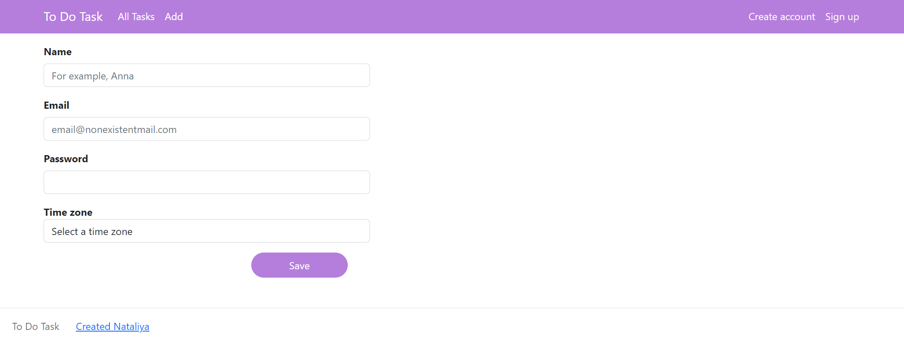
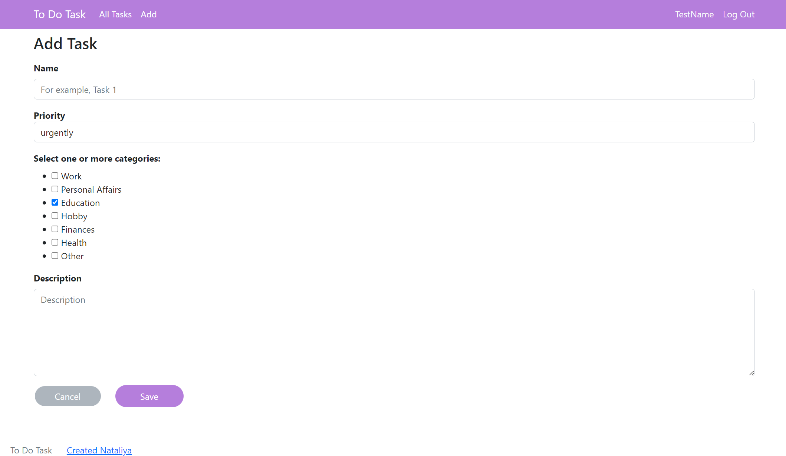
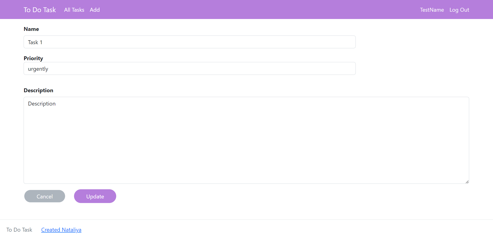

# job4j_todo

+ [Project description](#project-description)
+ [Technology stack](#technology-stack)
+ [Environment requirements](#environment-requirements)
+ [How to run the application](#how-to-run-the-application)
+ [How to stop the application](#how-to-stop-the-application)
+ [Application interaction](#Application-interaction)
____
### Project description

Task storage service. 
The service allows you to create, view description, delete a task. 
You can change the status of a task from undone to done and otherwise. 
You can view the list of all tasks, the list of done tasks or the list of undone tasks.
The division of rights:
1) Only authorized users can view and edit tasks.
2) All tasks are available to any authorized user

### Technology stack 

* Java 17
* PostgreSQL 14.5
* Spring Boot 2.7.6
* Hibernate 5.6.11
* Thymeleaf
* Liquibase 4.15.0
* Checkstyle Plugin 3.1.2

### Environment requirements

* Java 17
* Apache Maven 3.8.6
* PostgreSQL 14.5
* Git (If you will use the `git clone` command in the first paragraph [How to run the application](#how-to-run-the-application))

### How to run the application

1. Use the command in console:

   `git clone https://github.com/nataliya-nataliya/job4j_todo.git`

   or download project: [Download Zip](https://github.com/nataliya-nataliya/job4j_todo/archive/refs/heads/master.zip)
2. Create database:
   `create database cinema;`
3. Specify the username and password from DBMS PostgreSQL in the file [hibernate.cfg.xml](src/main/resources/hibernate.cfg.xml) and [liquibase.properties](db/liquibase.properties)
4. Use the command in console to run all sql scripts:
   `mvn liquibase:update -P production`
    or run all scripts from the folder: [db/scripts/](db/scripts)
5. Use the command in console to run:
   `mvn spring-boot:run`
6. Navigate to http://localhost:8080/index in a browser

### How to stop the application
Use console and press the keys:
`Ctrl + C` or `Ctrl + Break` or `Ctrl + Z`

### Application interaction
1. Login page:
   
____
2. Register page:
   
____
3. Main page:
   
____
4. Done tasks page
   
____
5. Undone tasks page
   
____
6. Task view page
   
____
7. Add task page
   
____
8. Edit task page
   
